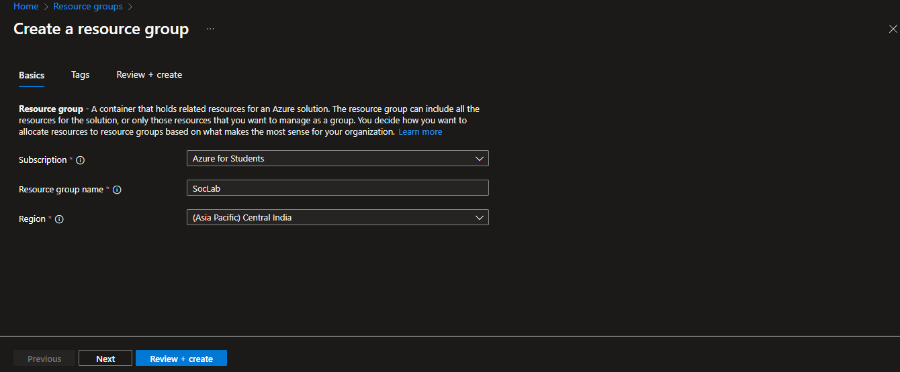

# Security Threat Detection via Cloud SIEM (Microsoft Sentinel)

In this  Project we are going to create a honeypot actually which will be just a Virtual machine in the Cloud. and we will expose that honeypot or that virtual machine on the Internet . and we are going to configure the logs forwarding (Log analytics)  which will forward the security related logs to the central repository , and then we will connect that repository to the  Cloud SIEM (Microsoft Sentinel) . and from that siem we can query the logs using the KQL. 

## Contents

I will Add Topic  this Later

---

## Goals

I will add this Topic later 

## Instructions

---

### Creating a resource Group

- Go to portal.azure.com
- Navigate to Resource Group and Click on Create to Create the resource group
- give the name to your resource group
- quick overview - here without creating resource group in the azure we cannot create resources . because resource group is a one type of the container where we can group all our related resources like vm’s and other things together.



### Creating a Virtual Network

- Click on virtual network and create a One
- Here our next step is to create a virtual network which will be in the same resource group that we have created above
- and the vm that we are going to create the next they are going to be in the same virtual network


### Create a vm (Cloud HoneyPot)

- go to the Azure Portal Home page , Click on Virtual Machine  and select Azure virtual machine from dropdownList that will appear to you and then  Click On **Create** to Create a Windows VM
- fill the required details
- Create a username and password.
- Click on “Review+create”.
- And then Click on “create”


---


now our task is to forward all these events to the azure central repository and then we can connect it to the Cloud SIEM (microsoft sentinel )  where we can query these events and do all kind of good stuff and specially threat hunting.

---

### Creating Log Analytics  Workspace

- search for log analytics workspace and Click on Create button to actually Create It.
- filled all the required details and put it into the same resource group that we have created early


---

### Create the Cloud SIEM Microsoft Sentinel  Instance

- go to Microsoft sentinel and Click on the Create button to create a instance
- after that we have to add or connect the log analytics workspace to the microsoft sentinel which we have created above


- Click on add button to add that sentinel to that log analytics workspace
- once that microsoft sentinel siem instance is created  next we have to configure the azure security event connector  which will make connections between our vm’s and the log analystics workspace so that we can recieve the logs into our Cloud siem  . it will help  us to forward all the logs to the central respository .

- go to your microsoft sentinel instance then click on content hub and search for security events . and choose “Windows Security events” and install that it will install that connector


- after installing this we have to configure it
- now Click on manage button to open something like this


- open the connector page
- Click "+Create data collection rule" and name the rule.


- click on create button to create this data collection  rule

after that is created now it will start collecting the logs from our vm and it will forward all that to the log Analytics repository 

---

- now we create our custom KQL queries to query our logs  and this KQL will help us to filter down our logs and see only those logs that we are  interested in.

### KQL

- Go back to Microsoft Sentinel > Logs.
- type the following command in your query box ```SecurityEvent | where EventID == 4625```
- Click on the run button or shift+enter
- to extract a specific field from the logs using the project keyword


Here SecurityEvent is the table and inside that table all the security related windows events are stored  and we have used a pipeline |  with the where clause to filter and show only those logs which EventID is 4625 means failed logged in attempt

```bash
SecurityEvent | where EventID == 4625
```


as you can see from above that there are total 41 failed loggedin attempts for account Administrator


as you can see that someone on the Internet is trying to Login to our machine from this particular Ip address. so this is how the threat hunting is Done on Cloud Using KQL queries  . it help us to query the logs easily
